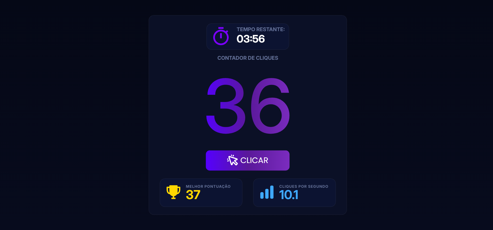

# ⚡ Clicker App

Um jogo de velocidade feito em React onde o objetivo é clicar o máximo possível antes do tempo acabar.



---

## 🚀 Tecnologias

- React
- JavaScript
- CSS
- React Icons
- Vite

---

## 🎮 Funcionalidades

- Sistema de contador de cliques
- Timer em tempo real
- Cálculo de CPS (Clicks Per Second)
- Sistema de recorde
- Tela de reinício animada
- Interface moderna com neon/glow

---

## 📦 Instalação

Clone o projeto:

```bash
git clone https://github.com/seuusuario/clicker-app.git
```

Entre na pasta:

```bash
cd clicker-app
```

Instale as dependências:

```bash
npm install
```

Execute o projeto:

```bash
npm run dev
```

---

## 📸 Preview

O projeto possui:

- UI neon futurista
- Gradientes modernos
- Glassmorphism
- Animações suaves
- Efeitos de hover e blur

---

## 📁 Estrutura

```bash
src/
 ├── assets/
 ├── components/
 ├── App.jsx
 ├── App.css
 └── main.jsx
```

---

## ✨ Futuras melhorias

- Sistema de contas
- Sons e efeitos
- Mobile version
- Diferentes dificuldades

---

## 👨‍💻 Autor

Feito por Gabriel Tenório.
